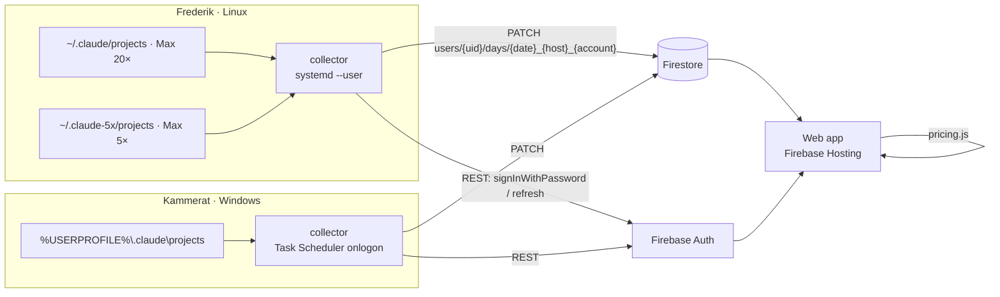
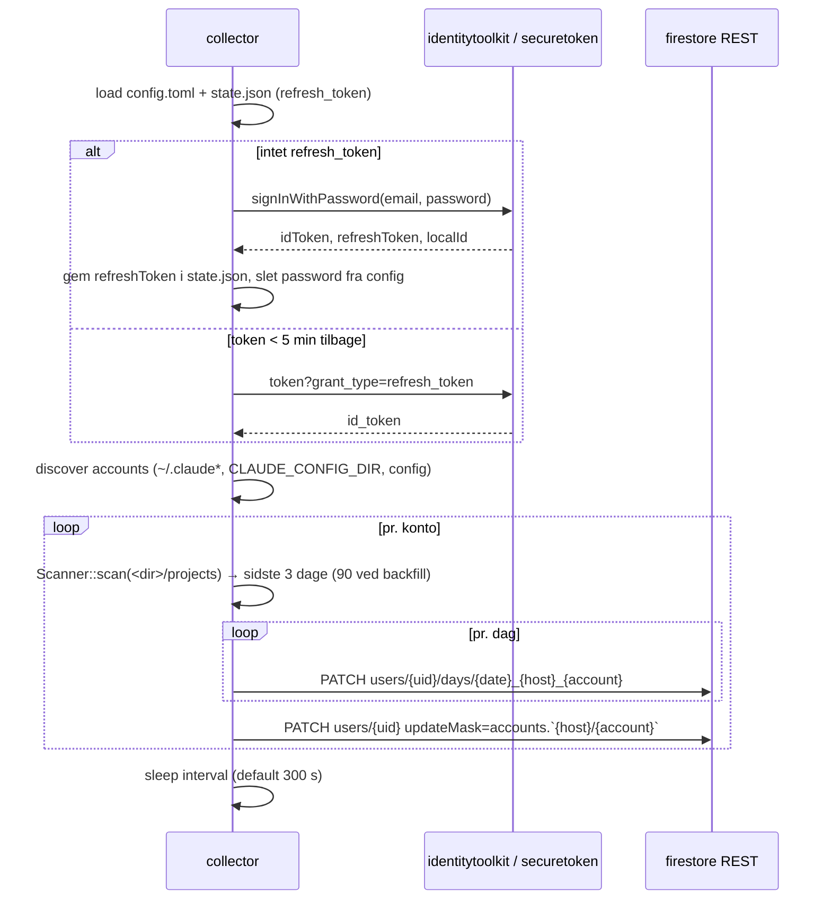

# Claude usage collector

Fælles dashboard for to personer med Claude Max-abonnementer: en lille collector-daemon på hver maskine (Linux + Windows) læser Claude Code-transskripter lokalt fra alle Claude-konti på maskinen, sender rå token-tal pr. dag/model/konto til Firestore, og en statisk web app viser hvad forbruget ville have kostet på API-priser mod det der faktisk betales i abonnementer (fx Max 20× $200 + Max 5× $100 på én maskine).

**Færdig når:** begge maskiner pusher automatisk efter login, dashboardet viser per person + samlet API-ækvivalent pris for indeværende kalendermåned (default) og seneste 30 dage, abonnementssummen udledes af de fundne konti, og tallene for Frederiks `~/.claude` matcher COSMIC-applet'ens popup (samme parser, samme pristabel). Kammeraten installerer fra en GitHub Release bygget af CI.

## Kontekst og scope

Datakilden er `<config-dir>/projects/*/*.jsonl`, hvor config-dir er `~/.claude` (Windows: `%USERPROFILE%\.claude`) eller en alternativ mappe sat via `CLAUDE_CONFIG_DIR` — én mappe pr. Claude-konto. På Frederiks maskine findes `~/.claude` (Max 20×) og `~/.claude-5x` (Max 5×). Hver mappe har en `.credentials.json` med `claudeAiOauth.subscriptionType` og `rateLimitTier` (fx `max` / `default_claude_max_20x`), som collector bruger til at udlede abonnementspris pr. konto. Hver `assistant`-linje har `message.model` og `message.usage` med `input_tokens`, `output_tokens`, `cache_read_input_tokens` og `cache_creation.{ephemeral_5m,ephemeral_1h}_input_tokens`. Samme `message.id` kan optræde flere gange (streaming-chunks) og skal dedup'es på `(message.id, requestId)`.

Parseren og pristabellen findes allerede i COSMIC-applet'en `~/Documents/dev/cosmic-dev-applets/applets/claude-usage` (`src/stats.rs`, `src/pricing.rs`) og portes 1:1.

**Non-goals (v1):** rate-limit-bars fra OAuth-usage-endpointet, transskript-indhold og tokens (kun tal og abonnementstype forlader maskinen; OAuth-tokenet læses aldrig), flere end ét team, sign-up-flow (de to Firebase-brugere oprettes manuelt i Firebase Console).

```wireframe browser: Dashboard — indeværende måned
<div class="wf-col">
  <div class="wf-row"><h1>Claude usage</h1><span><select><option>September 2026</option><option>Seneste 30 dage</option></select> <button>Log ud</button></span></div>
  <div class="wf-row">
    <div class="wf-card wf-col"><span class="wf-muted">API-ækvivalent, samlet</span><h2>$1.842</h2></div>
    <div class="wf-card wf-col"><span class="wf-muted">Betalt (Max 20× + Max 5× + Max 20×)</span><h2>$500</h2></div>
    <div class="wf-card wf-col"><span class="wf-muted">Sparet</span><h2>$1.342 · 3,7×</h2></div>
    <div class="wf-card wf-col"><span class="wf-muted">Cache hit rate</span><h2>91 %</h2></div>
  </div>
  <div class="wf-card"><p class="wf-muted">Dagligt forbrug, stablet pr. person, referencelinje = 500/30</p><p>▇▇▅▇▇▂▁▇▇▇▅▇▇▂▁▇▇▇▅▇▇▂▁▇▇▇▅▇▇▂</p></div>
  <table>
    <tr><th>Person</th><th>Konto</th><th>Sidst set</th><th>Maskine</th><th>Svar</th><th>Tokens</th><th>API-pris</th><th>Abonnement</th><th>Ratio</th></tr>
    <tr><td>Frederik</td><td>Max 20× (privat)</td><td>2 min siden</td><td>frederik-pc</td><td>2 910</td><td>355 M</td><td>$942</td><td>$200</td><td>4,7×</td></tr>
    <tr><td></td><td>Max 5× (arbejde)</td><td>2 min siden</td><td>frederik-pc</td><td>502</td><td>57 M</td><td>$162</td><td>$100</td><td>1,6×</td></tr>
    <tr><td>Kammerat</td><td>claude · Max 20×</td><td>14 min siden</td><td>DESKTOP-K9</td><td>2 108</td><td>287 M</td><td>$738</td><td>$200</td><td>3,7×</td></tr>
  </table>
  <table>
    <tr><th>Model</th><th>Input</th><th>Output</th><th>Cache read</th><th>Cache write</th><th>API-pris</th></tr>
    <tr><td>claude-fable-5-1</td><td>1,2 M</td><td>4,1 M</td><td>380 M</td><td>22 M</td><td>$1.611</td></tr>
    <tr><td>claude-sonnet-5</td><td>0,4 M</td><td>1,0 M</td><td>41 M</td><td>3 M</td><td>$231</td></tr>
  </table>
  <p class="wf-muted">Priser: Anthropic prisliste 2026-06-24. Ukendte modeller vises som "?".</p>
</div>
```

## Løsning



```callout decision Collector i Rust, sync, én statisk binary
Port af applet'ens `stats.rs` (allerede testet mod fixture) i et lille bin-crate uden libcosmic/tokio. HTTP via `ureq` med `rustls`, så cross-compile til `x86_64-pc-windows-gnu` virker uden OpenSSL. Kammeraten får en `.exe` — ingen runtime at installere. Node/Python ville kræve installation på Windows-maskinen.
```

```callout decision Firestore REST + email/password, ingen Cloud Functions
Collector kalder `identitytoolkit.googleapis.com` (`signInWithPassword` én gang, derefter `securetoken.googleapis.com` refresh) og skriver direkte til `firestore.googleapis.com` med idToken. Holder projektet på Spark-plan (gratis, intet kreditkort) og daemonen SDK-fri. Web-API-nøglen er offentlig by design; sikkerheden ligger i Firestore-rules.
```

```callout decision Collector sender rå tokens, web app'en priser
Priser ændrer sig, tokens gør ikke. `pricing.js` er en kopi af `pricing.rs`-tabellen og kan opdateres med ét deploy uden at røre daemons. Ukendt model → `?` i UI, aldrig et opdigtet tal (samme regel som applet'en).
```

```callout decision Én konto = én Claude-config-mappe; vilkårligt antal, valgfri placering
`[[accounts]]` i config er en liste uden øvre grænse: hver post har `path` (hvor som helst på disken), `label` (nøgle i Firestore, default = mappenavn uden foranstillet punktum) og valgfri `display` (vist i dashboardet). Derudover auto-discovery (`auto_discover = true`, default) af `~/.claude*`-mapper med `projects/` og `CLAUDE_CONFIG_DIR`, så nulkonfiguration virker for standardopsætningen. Samme mappe fundet ad to veje dedup'es på kanonisk sti; `exclude = [...]` fjerner labels. `claude-usage-collector accounts` printer hvad der er fundet, med sti, label, display og udledt abonnement, så man kan tjekke inden første push. Abonnement udledes af `.credentials.json` → `subscriptionType`/`rateLimitTier` med samme mapping som applet'ens `subscription_usd_per_month` (Pro $20, Max 5× $100, Max 20× $200); ukendt → `null`, dashboardet viser `?`, og `subscription_usd` i `[[accounts]]` overstyrer.
```

```callout decision Ét dokument pr. (dag, maskine, konto), fuld overskrivning
Doc-id `users/{uid}/days/{YYYY-MM-DD}_{hostname}_{account}` med felterne `date`, `host`, `account`, `models`, `updatedAt`. Collector re-aggregerer de seneste 3 lokale dage fra alle jsonl-filer og `PATCH`'er hele dokumentet — idempotent, ingen delta-state at miste. Flere maskiner og konti pr. person summeres i web app'en. Første kørsel backfiller 90 dage.
```

```callout decision Lukket, nyt Firebase-projekt: to brugere, alle autentificerede læser alt
Projekt `claude-usage-collector-fm` (Spark, Firestore i `eur3`, hosting på https://claude-usage-collector-fm.web.app). Sign-up slås fra i Auth-konsollen; de to Firebase-brugere oprettes manuelt. Rules: skriv kun under egen `uid`, læs for enhver autentificeret bruger. Ingen team-collection nødvendig i v1.
```

```callout decision Offentligt GitHub-repo, binaries via Release-CI
Repoet er offentligt (MIT). GitHub Actions bygger `x86_64-unknown-linux-gnu` og `x86_64-pc-windows-msvc` ved tag `v*` og lægger `claude-usage-collector-linux-x86_64.tar.gz` og `claude-usage-collector-windows-x86_64.zip` (med `install.ps1`) på releasen. Intet hemmeligt i repoet: `config.toml` ligger uden for, `.firebaserc`/web-API-key er offentlige by design. Windows bygges native på `windows-latest` i CI, så `x86_64-pc-windows-gnu` cross-compile lokalt er kun en dev-genvej.
```

```columns Task Scheduler onlogon | Windows Service (sc create) | Cron-agtig --once hvert 5. min
Kører som brugeren, ser `%USERPROFILE%`. Én `schtasks`-kommando i `install.ps1`. Binary bygget med `windows_subsystem = "windows"` så intet konsolvindue.
Kræver ingen admin.
---
Kører som SYSTEM uden brugerens `%USERPROFILE%` — skal have explicit sti og kredentialer, kræver admin og service-wrapper. Overkill for ét bruger-script.
---
Spawner en proces hvert 5. min; simpelt, men login-refresh-token skal læses/gemmes hver gang og der er ingen in-memory filcache. Fungerer som fallback (`--once`).
```

### Datamodel

`users/{uid}` (`accounts.*` skrives af collector ved hver push via `updateMask`, inkl. `display` fra config; `displayName` sættes manuelt i konsollen):

```json
{
  "displayName": "Frederik",
  "accounts": {
    "frederik-pc/claude":    { "display": "Max 20× (privat)",  "subscription": "max", "tier": "default_claude_max_20x", "subscriptionUsd": 200, "lastPush": "2026-09-03T14:02:11Z", "version": "0.1.0", "filesParsed": 412 },
    "frederik-pc/claude-5x": { "display": "Max 5× (arbejde)",  "subscription": "max", "tier": "default_claude_max_5x",  "subscriptionUsd": 100, "lastPush": "2026-09-03T14:02:11Z", "version": "0.1.0", "filesParsed": 88 }
  }
}
```

Web app'en summerer `subscriptionUsd` over konti hvis `lastPush` er inden for den valgte periode. Samme konto på to maskiner (samme login) tælles kun én gang: nøglen er `host/account`, men abonnementet dedup'es på `tier`+`account` i web app'en.

`users/{uid}/days/{2026-09-03_frederik-pc_claude}`:

```json
{
  "date": "2026-09-03", "host": "frederik-pc", "account": "claude", "updatedAt": "2026-09-03T14:02:11Z",
  "models": {
    "claude-fable-5-1": { "input": 1312, "output": 48210, "cache_read": 9812331, "cache_write_5m": 0, "cache_write_1h": 401220, "replies": 143 }
  }
}
```

Datoer er lokal dato på den maskine der scanner (samme som applet'en og Claude Codes egen dag-opdeling). Begge brugere i Europe/Copenhagen, så tallene er sammenlignelige.

### Push-sekvens



## Filer

```files
+ Cargo.toml                                  # workspace: members = ["collector"]
+ collector/Cargo.toml                        # bin claude-usage-collector; ureq(rustls), serde, serde_json, chrono, anyhow, dirs, toml, log, env_logger, hostname
+ collector/src/main.rs                       # CLI: run | --once | --backfill N | login | accounts | --config PATH
+ collector/src/stats.rs                      # port af applet'ens stats.rs: Scanner, ModelTotals, parse_file, dedup
+ collector/src/config.rs                     # config.toml (api_key, project_id, email, password?, interval_s, days) + state.json (refresh_token, uid)
+ collector/src/auth.rs                       # signInWithPassword, refresh, idToken-cache
+ collector/src/firestore.rs                  # Document-JSON encoding (integerValue som string), PATCH med updateMask
+ collector/src/accounts.rs                   # discovery af ~/.claude*-mapper + CLAUDE_CONFIG_DIR + config; label, projects-root, subscription fra .credentials.json
+ collector/src/logger.rs                     # stderr + <config-dir>/collector.log
+ collector/src/paths.rs                      # home/config-dir pr. OS via dirs; Windows %USERPROFILE%
+ collector/tests/fixtures/transcript_sample.jsonl  # kopi fra applet'en
+ collector/tests/stats.rs                    # dedup + bucket-tests (port af applet-tests)
+ collector/tests/accounts.rs                 # discovery i temp-home med .claude + .claude-5x, exclude, tier-mapping
+ .github/workflows/ci.yml                    # cargo test + clippy på push/PR
+ .github/workflows/release.yml               # tag v* → build linux-gnu + windows-msvc, upload artefakter til GitHub Release
+ LICENSE                                     # MIT
+ deploy/linux/claude-usage-collector.service # systemd --user unit
+ deploy/linux/install.sh                     # cargo build --release, kopier til ~/.local/bin, systemctl --user enable --now
+ deploy/windows/install.ps1                  # kopier .exe til %LOCALAPPDATA%\Programs\claude-usage-collector, schtasks /create /sc onlogon
+ deploy/windows/uninstall.ps1                # schtasks /delete, fjern filer
+ scripts/build-windows.sh                    # lokal dev-genvej: cargo build --release --target x86_64-pc-windows-gnu
+ firebase.json                               # hosting public=web, firestore rules/indexes, auth providers
+ .firebaserc                                 # default = claude-usage-collector-fm
+ firestore.rules
+ firestore.indexes.json
+ web/index.html                              # login + dashboard (vanilla, Firebase JS SDK compat fra gstatic, Chart.js fra cdnjs)
+ web/app.js                                  # auth, queries, aggregation, tabeller, chart
+ web/pricing.js                              # kopi af pricing.rs-tabellen, samme longest-prefix lookup
+ web/style.css
+ README.md                                   # opsætning for begge OS + Firebase-konsol-trin
  ../cosmic-dev-applets/applets/claude-usage/src/stats.rs     # kilde til port
  ../cosmic-dev-applets/applets/claude-usage/src/pricing.rs   # kilde til pricing.js
```

## Nøglekode

````tabs
=== config.toml
```toml
# ~/.config/claude-usage-collector/config.toml  (Windows: %APPDATA%\claude-usage-collector\config.toml)
api_key    = "AIza..."            # Firebase web API key (offentlig)
project_id = "claude-usage-xyz"
email      = "frederik@example.com"
password   = "..."                # slettes af collector efter første login; refresh_token lander i state.json
interval_s = 300
days       = 3                    # hvor mange lokale dage der re-pushes pr. kørsel
# host = "frederik-pc"            # default: OS hostname
# exclude = ["claude-test"]       # konto-labels der springes over

# Auto-discovery finder ~/.claude* med projects/ og $CLAUDE_CONFIG_DIR.
# Sæt auto_discover = false for kun at bruge listen nedenfor.
auto_discover = true

# Vilkårligt antal konti, hvor som helst på disken. `label` er nøglen i
# Firestore (default: mappenavn uden punktum), `display` er navnet i dashboardet.
[[accounts]]
path    = "~/.claude"
display = "Max 20× (privat)"

[[accounts]]
path    = "~/.claude-5x"
display = "Max 5× (arbejde)"

[[accounts]]
path            = "D:\\claude-profiles\\kunde-x"   # Windows-sti, label bliver "kunde-x"
label           = "kundex"
display         = "Kunde X"
subscription_usd = 100                              # overstyr hvis .credentials.json mangler eller tier er ukendt
```
=== accounts.rs
```rust
pub struct Account { pub label: String, pub display: Option<String>, pub dir: PathBuf, pub subscription: Option<Subscription> }
pub struct Subscription { pub kind: String, pub tier: String, pub usd: Option<u32> }

#[derive(Deserialize)]
pub struct AccountConfig { pub path: String, pub label: Option<String>, pub display: Option<String>, pub subscription_usd: Option<u32> }

/// Config [[accounts]] first (explicit wins), then — if auto_discover — ~/.claude* dirs with a
/// projects/ subdir and $CLAUDE_CONFIG_DIR. Deduplicated on canonical path, filtered by `exclude`.
/// `~` and env vars in `path` are expanded. Label = dir name without leading dot unless set.
pub fn discover(home: &Path, cfg: &Config) -> Vec<Account> { /* ... */ }

/// Reads <dir>/.credentials.json → claudeAiOauth.{subscriptionType, rateLimitTier}. Never reads the token.
pub fn read_subscription(dir: &Path) -> Option<Subscription> { /* ... */ }

pub fn subscription_usd(kind: &str, tier: &str) -> Option<u32> {
    match kind {
        "max" if tier.contains("20x") => Some(200),
        "max" if tier.contains("5x") => Some(100),
        "pro" => Some(20),
        _ => None,
    }
}
```
=== firestore.rs
```rust
pub struct Client { pub project_id: String, pub id_token: String }

impl Client {
    /// PATCH users/{uid}/days/{date}_{host}_{account}. Full document replace; idempotent.
    pub fn put_day(&self, uid: &str, host: &str, account: &str, date: NaiveDate, models: &BTreeMap<String, ModelTotals>) -> anyhow::Result<()> {
        let name = format!("users/{uid}/days/{date}_{host}_{account}");
        let body = json!({ "fields": {
            "date": { "stringValue": date.to_string() },
            "host": { "stringValue": host },
            "account": { "stringValue": account },
            "updatedAt": { "timestampValue": Utc::now().to_rfc3339() },
            "models": { "mapValue": { "fields": models.iter().map(|(m, t)| (m.clone(), totals_value(t))).collect::<Map<_,_>>() } },
        }});
        let url = format!("https://firestore.googleapis.com/v1/projects/{}/databases/(default)/documents/{name}", self.project_id);
        ureq::patch(&url).set("Authorization", &format!("Bearer {}", self.id_token)).send_json(body)?;
        Ok(())
    }
}

fn totals_value(t: &ModelTotals) -> Value {
    // Firestore integerValue is a string on the wire.
    json!({ "mapValue": { "fields": {
        "input": { "integerValue": t.input.to_string() },
        "output": { "integerValue": t.output.to_string() },
        "cache_read": { "integerValue": t.cache_read.to_string() },
        "cache_write_5m": { "integerValue": t.cache_write_5m.to_string() },
        "cache_write_1h": { "integerValue": t.cache_write_1h.to_string() },
        "replies": { "integerValue": t.replies.to_string() },
    }}})
}
```
=== firestore.rules
```text
rules_version = '2';
service cloud.firestore {
  match /databases/{db}/documents {
    match /users/{uid} {
      allow read: if request.auth != null;
      allow write: if request.auth != null && request.auth.uid == uid;
      match /days/{day} {
        allow read: if request.auth != null;
        allow write: if request.auth != null && request.auth.uid == uid;
      }
    }
  }
}
```
=== app.js (aggregation)
```javascript
// Sum days for all users in [from, to], priced client-side.
async function loadRange(db, from, to) {
  const users = await db.collection('users').get();
  const out = [];
  for (const u of users.docs) {
    const days = await u.ref.collection('days').where('date', '>=', from).where('date', '<=', to).get();
    const perDay = {};          // date -> { model -> totals }  (hosts + konti summeres)
    const perAccount = {};      // account -> { model -> totals }
    for (const d of days.docs) {
      const { date, account, models } = d.data();
      for (const [model, t] of Object.entries(models)) {
        addTotals((perDay[date] ??= {}), model, t);
        addTotals((perAccount[account] ??= {}), model, t);
      }
    }
    out.push({ uid: u.id, ...u.data(), perDay, perAccount });
  }
  return out;
}
// Abonnement: sum af subscriptionUsd over konti set i perioden, dedup'et på account+tier (samme login på to maskiner).
const subscriptionUsd = (u, from, to) => {
  const seen = new Map();
  for (const [key, a] of Object.entries(u.accounts ?? {})) {
    const account = key.split('/')[1];
    if (a.lastPush >= from) seen.set(`${account}:${a.tier}`, a.subscriptionUsd);
  }
  return [...seen.values()].reduce((s, v) => s + (v ?? 0), 0);
};
const costUsd = (model, t) => { const p = lookup(model); return p && (t.input*p.input + t.output*p.output + t.cache_read*p.cache_read + t.cache_write_5m*p.cache_write_5m + t.cache_write_1h*p.cache_write_1h) / 1e6; };
```
=== systemd unit
```ini
# ~/.config/systemd/user/claude-usage-collector.service
[Unit]
Description=Claude usage collector (pushes token stats to Firestore)
After=network-online.target

[Service]
Type=simple
ExecStart=%h/.local/bin/claude-usage-collector
Restart=on-failure
RestartSec=30

[Install]
WantedBy=default.target
```
=== install.ps1
```powershell
$dst = "$env:LOCALAPPDATA\Programs\claude-usage-collector"
New-Item -ItemType Directory -Force $dst | Out-Null
Copy-Item "$PSScriptRoot\claude-usage-collector.exe" $dst -Force
schtasks /create /f /sc onlogon /rl limited /tn "ClaudeUsageCollector" /tr "`"$dst\claude-usage-collector.exe`""
schtasks /run /tn "ClaudeUsageCollector"
```
````

## Trin

```steps Implementering
- [ ] Firebase: opret projekt, aktivér Auth (email/password, sign-up off), Firestore (europe-west), opret to brugere, notér api_key + project_id
- [ ] Workspace + `collector` crate: port `stats.rs` + fixture + tests fra applet'en; `cargo test` grøn
- [ ] `paths.rs` + `config.rs`: config-dir via `dirs`, state.json med refresh_token
- [ ] `accounts.rs`: `[[accounts]]` (path/label/display/subscription_usd, `~`-expansion) + discovery af `~/.claude*` og `CLAUDE_CONFIG_DIR`, dedup, exclude, tier→USD; `accounts`-subkommando; tests i temp-home med `.claude`, `.claude-5x` og en ekstern mappe
- [ ] `auth.rs`: signInWithPassword → refresh; slet password fra config efter første succes
- [ ] `firestore.rs` + `main.rs`: loop, `--once`, `--backfill 90`, log til fil under config-dir
- [ ] `firebase/firestore.rules` + deploy; verificér at bruger A ikke kan skrive under B (Rules Playground)
- [ ] `web/`: login, range-vælger (default indeværende kalendermåned, alternativ 30 dage), cards, dagsgraf, person/konto- og model-tabeller, abonnementssum fra `accounts`, `pricing.js`
- [ ] `deploy/linux/install.sh` + unit; kør på egen maskine, tjek `systemctl --user status`
- [ ] `.github/workflows/ci.yml` + `release.yml`; tag `v0.1.0`, verificér at Linux-tar og Windows-zip lander på releasen
- [ ] `deploy/windows/install.ps1`; kammeraten henter zip fra releasen og kører `install.ps1`; verificér at `%USERPROFILE%\.claude` findes
- [ ] README med begge OS-flows og konsol-trin
- [ ] Verifikation: applet-popup "30 dage" vs dashboard "seneste 30 dage" for kontoen `claude` afviger < 1 %; `claude-5x` dukker op som separat konto med $100; kammeratens host/konto dukker op i `users/{uid}.accounts`
```

## Risici

```callout risk Intermitterende 403 fra Firestore-rules lige efter deploy
Observeret ved første opsætning: ~1 af 20 writes fik `PERMISSION_DENIED` i flere minutter efter rules-deploy, også med korrekt token og body; en `hasOnly`-key-check i rules gjorde det ikke bedre og er droppet (uid-scoping er den reelle sikkerhed). Collector'en retry'er hvert dokument én gang og re-pusher alligevel de seneste `days` dage ved næste interval, så en enkelt fejl selvhelbreder.
```

```callout risk Firestore-læsninger vokser med dage × hosts
30 dage × 3 (host, konto)-par = 90 docs pr. dashboard-load — langt under Spark-kvoten (50k reads/dag). Bliver det mange hosts eller lange perioder, tilføj et `users/{uid}/months/{YYYY-MM}`-aggregat skrevet af collector.
```

```callout risk Password i klartekst i config.toml indtil første login
Collector sletter feltet efter succes og gemmer kun refresh_token (kan revokeres i konsollen). Alternativ: `claude-usage-collector login` der prompter interaktivt og aldrig skriver password til disk — tages med, config-feltet er kun fallback for headless setup.
```

```callout risk Windows-stier og hostname
`%USERPROFILE%\.claude\projects` og `CLAUDE_CONFIG_DIR` skal testes på en rigtig Windows-maskine; `hostname`-crate og `dirs::config_dir()` (→ `%APPDATA%`) skal verificeres i samme omgang. Ingen Windows-maskine lokalt, så første test sker på kammeratens.
```

```callout risk Abonnement udledes af rateLimitTier-strengen
Mappingen `default_claude_max_20x` → $200 er udledt af den samme streng applet'en bruger; Anthropic kan omdøbe tiers eller ændre priser uden varsel. Ukendt tier giver `null`, dashboardet viser `?` i abonnementskolonnen, og `subscription_usd` i `[[accounts]]` sætter beløbet manuelt.
```

```callout risk Pristabel drifter fra virkeligheden
Tabellen er dateret 2026-06-24. Prisændringer kræver manuel opdatering af `web/pricing.js` (og applet'ens `pricing.rs`). Dashboard viser datoen i footeren, så det er synligt hvor gamle priserne er.
```

## Åbne spørgsmål

Ingen. Alle valg er truffet ovenfor.
